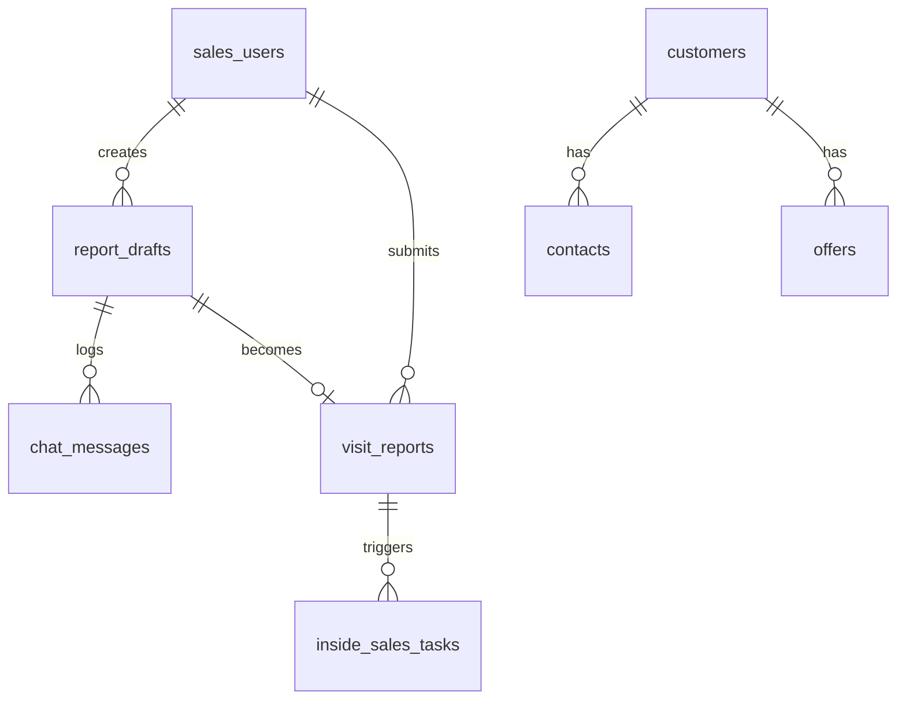

# MVP 02: Datenmodell und technischer Zuschnitt

## 1. Ziel dieses Dokuments

Dieses Dokument konkretisiert das Datenmodell für den MVP des sprachgeführten Besuchsbericht Assistenten.

Der erste Konzeptstand beschreibt bereits Ziel, fachlichen Scope, Gesprächslogik und MVP Grenzen. Dieses Dokument übersetzt diese Grundlage in konkrete Datenobjekte, Tabellen, Beziehungen, Statuswerte und erste Demo Daten.

Ziel ist nicht, ein vollständiges CRM zu modellieren. Ziel ist ein bewusst kleines Muster CRM, das genug Struktur bietet, um den Kernprozess realistisch zu demonstrieren:

- Login eines Außendienstlers
- Start eines Besuchsberichts
- geführte Chat Erfassung
- CRM Validierung
- strukturierter Draft
- finaler Bericht
- finale Bestätigung
- Speicherung
- optionale Innendienstaufgabe

## 2. Grundentscheidung für den MVP

Für den MVP wird ein relationales Datenmodell verwendet.

Empfohlene erste Umsetzung:

| Bereich | MVP Entscheidung |
|---|---|
| Datenbank | SQLite |
| Backend | FastAPI |
| Frontend | React oder einfache mobile Web UI |
| ORM | SQLAlchemy oder SQLModel |
| LLM Anbindung | austauschbare Provider Schnittstelle |
| erster Modus | textbasierter Chat |
| späterer Modus | Speech to Text und Text to Speech als Layer |

SQLite ist für den MVP ausreichend, weil:

- die Datenmenge klein bleibt
- lokale Entwicklung einfacher ist
- keine Server Datenbank eingerichtet werden muss
- Tabellen und Beziehungen trotzdem realistisch modelliert werden können
- ein späterer Wechsel auf PostgreSQL möglich bleibt

PostgreSQL wäre fachlich sauberer für eine produktionsnahe Lösung, ist aber für den ersten Prototyp nicht notwendig.

## 3. Kernobjekte

Das Datenmodell besteht aus acht Kernobjekten.

| Objekt | Zweck |
|---|---|
| `sales_users` | bekannte Außendienstler |
| `customers` | bestehende B2B Kunden im Muster CRM |
| `contacts` | Ansprechpartner bei Kunden |
| `offers` | bestehende Angebote im Muster CRM |
| `report_drafts` | laufende oder unterbrochene Berichtsentwürfe |
| `chat_messages` | Gesprächsverlauf pro Bericht |
| `visit_reports` | final bestätigte oder blockierte Besuchsberichte |
| `inside_sales_tasks` | einfache Aufgaben für Innendienst oder Nachbearbeitung |

Diese Objekte bilden bewusst nur den Teil eines CRM ab, der für den Besuchsbericht Assistenten notwendig ist.

## 4. Beziehungen im Überblick



Wichtig ist die Trennung zwischen `report_drafts` und `visit_reports`.

`report_drafts` sind Arbeitsstände. Sie können unvollständig, korrigiert, unterbrochen oder noch nicht bestätigt sein.

`visit_reports` sind das Ergebnis nach finaler Bestätigung oder ein bewusst blockierter Bericht, wenn Stammdaten noch geprüft werden müssen.

## 5. Tabelle `sales_users`

Zweck:

Speichert die bekannten Außendienstler, die Berichte erstellen dürfen.

| Feld | Typ | Pflicht | Beschreibung |
|---|---|---:|---|
| `id` | string | ja | technische ID, zum Beispiel `USER-001` |
| `name` | string | ja | Anzeigename |
| `email` | string | ja | Login Kennung |
| `password_hash` | string | ja | Passwort Hash oder Demo Hash |
| `region` | string | nein | Vertriebsgebiet |
| `language_preference` | string | ja | bevorzugte UI oder Gesprächssprache |
| `is_active` | boolean | ja | Nutzer aktiv |
| `created_at` | datetime | ja | Anlagezeitpunkt |

MVP Hinweis:

Für eine erste Demo kann statt echter Passwortlogik auch ein Demo Login mit PIN genutzt werden. Trotzdem sollte das Datenmodell bereits einen Hash vorsehen, damit die Richtung fachlich korrekt bleibt.

## 6. Tabelle `customers`

Zweck:

Speichert bestehende B2B Kunden im Muster CRM.

| Feld | Typ | Pflicht | Beschreibung |
|---|---|---:|---|
| `id` | string | ja | technische ID, zum Beispiel `CUST-1001` |
| `customer_number` | string | ja | sichtbare Kundennummer |
| `company_name` | string | ja | offizieller Firmenname |
| `short_name` | string | nein | Kurzname für Erkennung, zum Beispiel `NordTech` |
| `city` | string | nein | Ort |
| `country` | string | ja | Land |
| `customer_language` | string | ja | Sprache des finalen CRM Berichts |
| `status` | string | ja | zum Beispiel `active` oder `inactive` |
| `created_at` | datetime | ja | Anlagezeitpunkt |

Wichtig:

Die Sprache des finalen Berichts kommt aus `customer_language`, nicht aus der Sprache des Gesprächs.

## 7. Tabelle `contacts`

Zweck:

Speichert Ansprechpartner, die einem bestehenden Kunden zugeordnet sind.

| Feld | Typ | Pflicht | Beschreibung |
|---|---|---:|---|
| `id` | string | ja | technische ID, zum Beispiel `CONT-2001` |
| `customer_id` | string | ja | Fremdschlüssel auf `customers.id` |
| `first_name` | string | ja | Vorname |
| `last_name` | string | ja | Nachname |
| `full_name` | string | ja | vollständiger Name |
| `role` | string | nein | Funktion beim Kunden |
| `email` | string | nein | E Mail Adresse |
| `phone` | string | nein | Telefonnummer |
| `is_active` | boolean | ja | Ansprechpartner aktiv |
| `created_at` | datetime | ja | Anlagezeitpunkt |

MVP Verhalten:

Wenn ein Ansprechpartner genannt wird, aber nicht beim Kunden vorhanden ist, wird er nicht automatisch angelegt. Stattdessen kann eine Innendienstaufgabe vom Typ `new_contact_review` entstehen.

## 8. Tabelle `offers`

Zweck:

Speichert eine kleine Auswahl bestehender Angebote, damit Angebotsbezüge validiert werden können.

| Feld | Typ | Pflicht | Beschreibung |
|---|---|---:|---|
| `id` | string | ja | technische ID, zum Beispiel `OFF-3001` |
| `offer_number` | string | ja | Angebotsnummer, zum Beispiel `Q-2026-1007` |
| `customer_id` | string | ja | Fremdschlüssel auf `customers.id` |
| `title` | string | ja | kurze Angebotsbeschreibung |
| `status` | string | ja | zum Beispiel `open`, `sent`, `accepted`, `lost` |
| `amount` | decimal | nein | Angebotswert |
| `currency` | string | ja | Währung |
| `valid_until` | date | nein | Gültigkeit |
| `created_at` | datetime | ja | Anlagezeitpunkt |

MVP Verhalten:

Ein Angebot wird nur verknüpft, wenn es existiert und zum erkannten Kunden gehört. Wenn eine Angebotsnummer genannt wird, aber nicht gefunden wird, bleibt sie als Freitext Referenz erhalten und kann eine Klärungsaufgabe auslösen.

## 9. Tabelle `report_drafts`

Zweck:

Speichert den aktuellen Arbeitsstand eines noch nicht final gespeicherten Besuchsberichts.

| Feld | Typ | Pflicht | Beschreibung |
|---|---|---:|---|
| `id` | string | ja | technische ID, zum Beispiel `DRAFT-4001` |
| `sales_user_id` | string | ja | Fremdschlüssel auf `sales_users.id` |
| `visit_report_id` | string | nein | späterer Link auf finalen Bericht |
| `draft_state_json` | json | ja | strukturierter Conversation State |
| `status` | string | ja | Draft Status |
| `last_question` | string | nein | zuletzt gestellte Frage |
| `missing_fields_json` | json | ja | aktuell offene Felder |
| `created_at` | datetime | ja | Anlagezeitpunkt |
| `updated_at` | datetime | ja | letzter Änderungszeitpunkt |

Empfohlene Draft Statuswerte:

| Status | Bedeutung |
|---|---|
| `in_progress` | Gespräch läuft oder wurde unterbrochen |
| `needs_user_input` | System wartet auf Antwort |
| `ready_for_review` | Pflichtfelder sind vollständig |
| `pending_confirmation` | finaler Review wurde erzeugt |
| `cancelled` | Entwurf wurde abgebrochen |

Der Draft ist die zentrale Arbeitsgrundlage für die LLM. Die LLM bekommt bei jedem Turn den aktuellen Draft, die relevanten CRM Daten und den letzten Chat Kontext.

## 10. Tabelle `chat_messages`

Zweck:

Speichert den Gesprächsverlauf pro Berichtsentwurf.

| Feld | Typ | Pflicht | Beschreibung |
|---|---|---:|---|
| `id` | string | ja | technische ID, zum Beispiel `MSG-5001` |
| `report_draft_id` | string | ja | Fremdschlüssel auf `report_drafts.id` |
| `sender` | string | ja | `user`, `assistant` oder `system` |
| `message_text` | text | ja | Nachrichtentext |
| `message_type` | string | ja | Art der Nachricht |
| `created_at` | datetime | ja | Zeitpunkt der Nachricht |

Empfohlene `message_type` Werte:

| Wert | Bedeutung |
|---|---|
| `free_input` | freie Nutzereingabe |
| `assistant_question` | Rückfrage der KI |
| `assistant_confirmation` | Bestätigung des verstandenen Inhalts |
| `correction` | Nutzerkorrektur |
| `final_review` | vollständiger Review vor Speicherung |
| `system_event` | technische oder fachliche Systemmeldung |

Der Chatverlauf ist wichtig für Debugging, Nachvollziehbarkeit und Fortsetzung.

## 11. Tabelle `visit_reports`

Zweck:

Speichert den finalen oder blockierten Besuchsbericht.

| Feld | Typ | Pflicht | Beschreibung |
|---|---|---:|---|
| `id` | string | ja | technische ID, zum Beispiel `REPORT-6001` |
| `sales_user_id` | string | ja | Außendienstler aus Login Kontext |
| `customer_id` | string | nein | bestehender Kunde, falls vorhanden |
| `contact_id` | string | nein | bestehender Ansprechpartner, falls vorhanden |
| `visit_date` | date | ja | Datum des Besuchs |
| `visit_type` | string | ja | Besuchsart |
| `reason_code` | string | ja | Besuchsanlass als Code |
| `related_offer_id` | string | nein | verknüpftes Angebot |
| `external_offer_reference` | string | nein | genannte, aber nicht validierte Angebotsnummer |
| `summary` | text | ja | Gesprächszusammenfassung |
| `outcome` | text | ja | Ergebnis oder Vereinbarung |
| `next_action` | text | ja | nächster Schritt |
| `follow_up_date` | date | nein | Wiedervorlagedatum |
| `priority` | string | ja | Vertriebsbewertung |
| `report_language` | string | ja | Sprache des finalen Berichtstexts |
| `final_report_text` | text | ja | ausformulierter CRM Bericht |
| `status` | string | ja | finaler Berichtstatus |
| `confirmed_at` | datetime | nein | Zeitpunkt der Nutzerbestätigung |
| `submitted_at` | datetime | nein | Zeitpunkt der Speicherung |
| `created_at` | datetime | ja | Anlagezeitpunkt |

Empfohlene Berichtstatuswerte:

| Status | Bedeutung |
|---|---|
| `submitted` | Bericht wurde final gespeichert |
| `blocked_master_data` | Bericht ist fachlich erstellt, aber Stammdatenprüfung offen |
| `inside_sales_review` | Bericht erzeugt mindestens eine Innendienstaufgabe |
| `cancelled` | Bericht wurde abgebrochen |

Für den MVP sollte `confirmed` nicht als dauerhafter Endstatus nötig sein. Die Bestätigung kann über `confirmed_at` dokumentiert werden. Danach wird der Bericht direkt als `submitted`, `blocked_master_data` oder `inside_sales_review` gespeichert.

## 12. Tabelle `inside_sales_tasks`

Zweck:

Speichert einfache Aufgaben für Innendienst oder spätere CRM Bearbeitung.

| Feld | Typ | Pflicht | Beschreibung |
|---|---|---:|---|
| `id` | string | ja | technische ID, zum Beispiel `TASK-7001` |
| `linked_visit_report_id` | string | nein | Bezug zum Besuchsbericht |
| `task_type` | string | ja | Art der Aufgabe |
| `title` | string | ja | kurzer Aufgabentitel |
| `description` | text | ja | Aufgabenbeschreibung |
| `detected_customer_name` | string | nein | erkannter Name bei unbekanntem Kunden |
| `detected_contact_name` | string | nein | erkannter Name bei unbekanntem Kontakt |
| `related_customer_id` | string | nein | Bezug auf bestehenden Kunden |
| `status` | string | ja | Aufgabenstatus |
| `due_date` | date | nein | Fälligkeitsdatum |
| `created_at` | datetime | ja | Anlagezeitpunkt |

Empfohlene `task_type` Werte:

| Wert | Bedeutung |
|---|---|
| `new_contact_review` | neuer Ansprechpartner muss geprüft werden |
| `new_lead_review` | neuer Lead oder Interessent muss geprüft werden |
| `create_offer` | neues Angebot soll erstellt werden |
| `clarify_offer_details` | Angebotsbezug ist unklar |
| `master_data_review` | Stammdaten müssen geprüft werden |
| `follow_up_call` | Rückruf oder Nachfassaktion |

Empfohlene Aufgabenstatuswerte:

| Status | Bedeutung |
|---|---|
| `open` | Aufgabe ist offen |
| `in_review` | Aufgabe wird geprüft |
| `done` | Aufgabe wurde erledigt |
| `cancelled` | Aufgabe wurde verworfen |

## 13. Kontrollierte Codes

Die Anwendung sollte kontrollierte Codes verwenden. Dadurch bleibt das Datenmodell sprachneutral.

### 13.1 `visit_type`

| Code | Bedeutung |
|---|---|
| `on_site` | Besuch vor Ort |
| `phone` | Telefonat |
| `video` | Videotermin |
| `trade_fair` | Messegespräch |
| `other` | Sonstiger Kontakt |

### 13.2 `reason_code`

| Code | Bedeutung |
|---|---|
| `offer_follow_up` | Nachfassung zu bestehendem Angebot |
| `new_demand` | neuer Bedarf |
| `relationship_meeting` | allgemeiner Kundenbesuch |
| `contract_discussion` | Vertragsgespräch |
| `lead_initial_contact` | Erstkontakt mit Interessent |
| `complaint_related` | Beschwerde oder Problem wurde erwähnt |
| `other` | sonstiger Anlass |

### 13.3 `priority`

| Code | Bedeutung |
|---|---|
| `low` | niedrige Vertriebspriorität |
| `medium` | mittlere Vertriebspriorität |
| `high` | hohe Vertriebspriorität |
| `critical` | sehr hohe oder zeitkritische Priorität |

## 14. Draft State JSON

Der Draft State ist der zentrale Arbeitsstand des Gesprächs.

Er sollte nicht als unstrukturierter Text gespeichert werden, sondern als validierbares JSON Objekt.

Beispiel:

```json
{
  "report_status": "in_progress",
  "conversation_language": "de",
  "report_language": "en",
  "sales_user": {
    "sales_user_id": "USER-001"
  },
  "customer": {
    "crm_customer_id": "CUST-1001",
    "detected_name": "NordTech",
    "validation_status": "matched"
  },
  "contact": {
    "crm_contact_id": "CONT-2001",
    "detected_name": "Frau Keller",
    "validation_status": "matched"
  },
  "visit": {
    "visit_date": "2026-06-22",
    "visit_type": "on_site",
    "reason_code": "offer_follow_up"
  },
  "offer": {
    "is_offer_related": true,
    "offer_number": "Q-2026-1007",
    "crm_offer_id": "OFF-3001",
    "validation_status": "matched"
  },
  "content": {
    "summary": "The customer discussed the open framework agreement offer.",
    "outcome": null,
    "next_action": null,
    "follow_up_date": null,
    "priority": null
  },
  "tasks": [],
  "missing_fields": [
    "outcome",
    "next_action",
    "follow_up_date",
    "priority"
  ],
  "last_question": "Was war das Ergebnis des Gesprächs?"
}
```

## 15. Validierungsstatus im Draft

Für erkannte Objekte sollte ein eigener Validierungsstatus gespeichert werden.

| Status | Bedeutung |
|---|---|
| `not_provided` | Information wurde noch nicht genannt |
| `detected_unvalidated` | Information wurde erkannt, aber noch nicht geprüft |
| `matched` | Information wurde eindeutig im Muster CRM gefunden |
| `ambiguous` | mehrere mögliche Treffer |
| `unknown` | kein Treffer im Muster CRM |
| `confirmed_new` | Nutzer hat bestätigt, dass es sich um neue Daten handelt |

Diese Statuswerte sind wichtig, weil ein erkannter Name nicht automatisch ein valider CRM Bezug ist.

## 16. Demo Stammdaten

Für den MVP reichen drei bis vier Kunden.

### 16.1 Beispielkunden

| ID | Kundennummer | Name | Kurzname | Sprache |
|---|---|---|---|---|
| `CUST-1001` | `K-1001` | NordTech Solutions AG | NordTech | `de` |
| `CUST-1002` | `K-1002` | UrbanBuild GmbH | UrbanBuild | `de` |
| `CUST-1003` | `K-1003` | GreenMed Devices Ltd. | GreenMed | `en` |
| `CUST-1004` | `K-1004` | Atlas Components BV | Atlas | `en` |

### 16.2 Beispielkontakte

| ID | Kunde | Name | Rolle |
|---|---|---|---|
| `CONT-2001` | `CUST-1001` | Sabine Keller | Head of Purchasing |
| `CONT-2002` | `CUST-1001` | Martin Becker | Operations Manager |
| `CONT-2003` | `CUST-1002` | Julia Brandt | Commercial Manager |
| `CONT-2004` | `CUST-1003` | Emily Carter | Procurement Lead |
| `CONT-2005` | `CUST-1004` | Thomas van Dijk | Managing Director |

### 16.3 Beispielangebote

| ID | Nummer | Kunde | Titel | Status |
|---|---|---|---|---|
| `OFF-3001` | `Q-2026-1007` | `CUST-1001` | Framework Agreement 2026 | `open` |
| `OFF-3002` | `Q-2026-1011` | `CUST-1002` | Initial Equipment Package | `sent` |
| `OFF-3003` | `Q-2026-1018` | `CUST-1003` | Service Extension Proposal | `open` |

Diese Daten reichen aus, um folgende MVP Fälle zu testen:

- bekannter Kunde mit bekanntem Ansprechpartner
- bekannter Kunde mit unbekanntem Ansprechpartner
- bekannter Kunde mit bestehendem Angebot
- bekannter Kunde mit falscher Angebotsnummer
- englische finale Berichtssprache
- neuer Lead oder unbekannter Kunde

## 17. Fachliche Speicherregeln

### 17.1 Normalfall

Wenn Kunde, Ansprechpartner und Pflichtfelder vollständig sind:

- `visit_reports.status = submitted`
- keine Innendienstaufgabe nötig
- `report_drafts.visit_report_id` wird gesetzt

### 17.2 Neuer Ansprechpartner

Wenn der Kunde existiert, aber der Ansprechpartner unbekannt ist:

- Bericht kann erstellt werden
- `visit_reports.status = inside_sales_review`
- Aufgabe `new_contact_review` wird erstellt
- erkannter Ansprechpartner wird nicht automatisch in `contacts` gespeichert

### 17.3 Neuer Lead

Wenn kein bestehender Kunde zugeordnet werden kann und der Nutzer einen Lead bestätigt:

- Bericht oder Lead Notiz wird gespeichert
- `visit_reports.status = inside_sales_review`
- Aufgabe `new_lead_review` wird erstellt
- kein neuer Kunde wird automatisch angelegt

### 17.4 Unklare Stammdaten

Wenn Kunde oder Kontakt nicht sicher validiert werden kann:

- Bericht wird nicht als normal eingereicht
- `visit_reports.status = blocked_master_data`
- Aufgabe `master_data_review` wird erstellt

### 17.5 Neues Angebot

Wenn aus dem Gespräch ein neues Angebot entstehen soll:

- Bericht hält den Bedarf fest
- Aufgabe `create_offer` wird erstellt
- kein Angebot wird automatisch in `offers` angelegt

## 18. Erster API Zuschnitt

Die konkrete API kann später angepasst werden. Für den MVP ist folgender Zuschnitt sinnvoll.

| Methode | Pfad | Zweck |
|---|---|---|
| `POST` | `/auth/login` | Nutzer anmelden |
| `GET` | `/dashboard` | offene und letzte Berichte laden |
| `POST` | `/report-drafts` | neuen Berichtsentwurf starten |
| `GET` | `/report-drafts/{draft_id}` | Entwurf laden |
| `POST` | `/report-drafts/{draft_id}/messages` | Nutzernachricht verarbeiten |
| `POST` | `/report-drafts/{draft_id}/review` | finalen Review erzeugen |
| `POST` | `/report-drafts/{draft_id}/confirm` | Bericht final bestätigen und speichern |
| `POST` | `/report-drafts/{draft_id}/cancel` | Entwurf abbrechen |
| `GET` | `/visit-reports` | eigene Berichte laden |
| `GET` | `/visit-reports/{report_id}` | einzelnen Bericht laden |

Wichtig:

Die Route `/report-drafts/{draft_id}/messages` ist der zentrale Conversation Turn. Dort passieren Extraktion, Validierung, State Update und nächste Antwort.

## 19. LLM Ausgabe als kontrollierter Vertrag

Die LLM sollte nicht direkt Datenbankeinträge erzeugen.

Stattdessen sollte sie eine kontrollierte Antwortstruktur liefern.

Beispiel:

```json
{
  "assistant_message": "Ich habe verstanden: Kunde ist NordTech und Ansprechpartnerin ist Frau Keller. Ist das korrekt?",
  "extracted_updates": {
    "customer.detected_name": "NordTech",
    "contact.detected_name": "Frau Keller",
    "visit.reason_code": "offer_follow_up"
  },
  "corrections": [],
  "confidence": {
    "customer": 0.86,
    "contact": 0.78,
    "reason_code": 0.72
  },
  "next_action": "confirm_detected_fields"
}
```

Das Backend prüft anschließend:

- Sind die Felder erlaubt?
- Passen die Codes?
- Gibt es CRM Treffer?
- Welche Pflichtfelder fehlen?
- Darf ein finaler Bericht erzeugt werden?

Damit bleibt die Geschäftslogik in der Anwendung und nicht in der LLM.

## 20. Nächste Konzeptentscheidung

Die nächste sinnvolle Entscheidung ist die konkrete technische MVP Architektur.

Empfohlene Festlegung:

| Frage | Entscheidung |
|---|---|
| Backend | FastAPI |
| Datenbank | SQLite |
| Frontend | React mit mobiler Ansicht |
| LLM Provider | austauschbare Adapterklasse |
| erster LLM Test | lokales Modell über LM Studio oder API kompatible Schnittstelle |
| Validierung | Pydantic Schemas im Backend |
| erster MVP Modus | Textchat |

Diese Entscheidung hält den MVP klein, aber technisch sauber.

## 21. Ergebnis

Mit diesem Datenmodell ist der MVP fachlich umsetzbar.

Der nächste Konzeptschritt sollte `MVP_03_Conversation_Flow.md` sein.

Darin sollte festgelegt werden:

- wie ein Turn verarbeitet wird
- welche Pflichtfelder wann abgefragt werden
- wie Korrekturen Vorrang bekommen
- wie CRM Validierung in den Gesprächsfluss eingebaut wird
- wie der finale Review erzeugt wird
- wie die finale Bestätigung technisch verarbeitet wird
