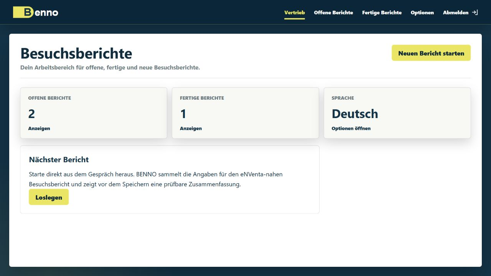
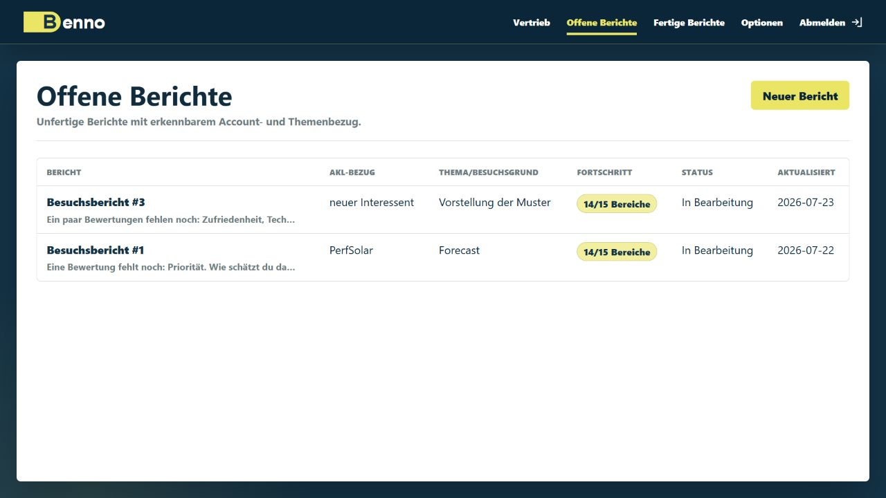
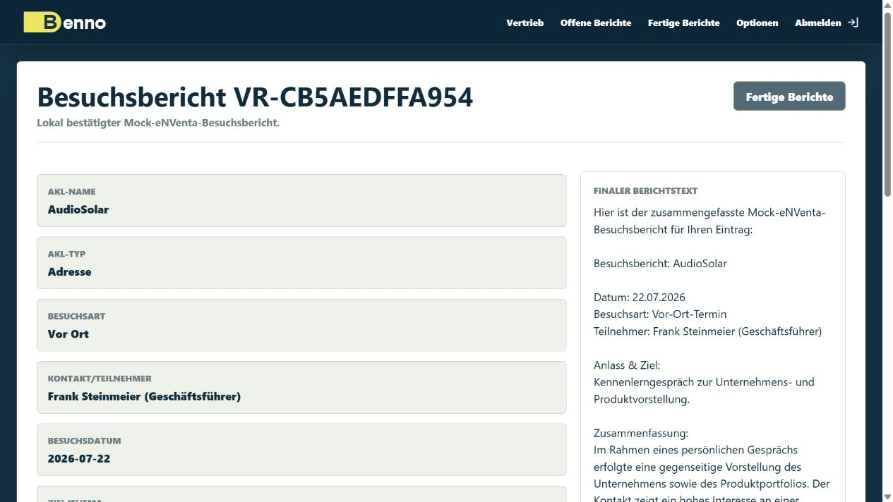

# BENNO

BENNO means **B2B Encounter Notes and Next-step Organizer**.

BENNO is a voice-assisted visit report assistant for B2B field sales. It turns
natural-language meeting notes into structured, reviewable CRM/ERP-ready reports
and follow-up reminders.

The current Masterschool MVP uses a Gemini-assisted German report workflow on
top of Flask, SQLite, and an eNVenta-shaped mock CRM/ERP gateway. Confirmed
reports are saved locally only after explicit review. The first turn-based voice
layer uses browser audio capture, local Speaches STT, and local Kokoro/Martin
TTS.

> **Demo scope:** BENNO currently uses fictional seed data and Mock-eNVenta
> writeback. It is not a production deployment and must not be connected to real
> customer or employee data.

## Screenshots

### Sales Workspace



### Open Visit Reports



### Confirmed Mock-eNVenta Report



## Requirements

- Python 3.11 or newer
- a Gemini API key for the full AI-assisted report workflow
- SQLite, included with Python, for the local mock database
- a modern browser for the responsive text workflow
- Docker plus compatible Speaches and Kokoro/Martin services for optional voice
- HTTPS or another secure browser context for microphone capture on phones and
  tablets

Development and test tooling is installed through the `dev` extra documented
below. The complete dependency declaration lives in `pyproject.toml`; a separate
`requirements.txt` is not required.

## Local Setup And Start

Create and activate a virtual environment:

```powershell
python -m venv .venv
.venv\Scripts\Activate.ps1
```

Install the project with development dependencies:

```powershell
python -m pip install --upgrade pip setuptools
python -m pip install -e ".[dev]"
```

Copy `.env.example` to `.env` and adjust local values if needed. Leave
`DATABASE_URL` unset for the default local SQLite file:
`sqlite:///benno-dev.sqlite3`.

Create the local tables and fictional demo users:

```powershell
flask --app benno:create_app seed-db
```

Run the application:

```powershell
flask --app benno:create_app run
```

Open `http://127.0.0.1:5000` in a browser.

## Local Voice Prerequisites

Voice is optional. The text report workflow remains available when the local
voice services are stopped or unavailable. BENNO does not start the voice
containers itself; compatible services must be available at the URLs configured
through `SPEACHES_BASE_URL` and `KOKORO_BASE_URL`.

On the current development PC, start the existing containers with:

```powershell
docker start speaches kokoro-onnx
```

Check that Speaches exposes its models and that BENNO can generate Kokoro/Martin
audio through the configured TTS endpoint:

```powershell
Invoke-RestMethod http://127.0.0.1:8000/v1/models
flask --app benno:create_app prewarm-voice-cache
```

Container names are specific to the current development PC. On another machine,
start equivalent OpenAI-compatible Speaches and Kokoro/Martin services and set
their base URLs in `.env`.

To open BENNO from another device in the same local network, start Flask with a
LAN-visible host:

```powershell
flask --app benno:create_app run --host 0.0.0.0 --port 5000
```

On the current development PC, the iPad URL is usually
`http://192.168.0.42:5000`. If the page does not load, check that Windows
Firewall allows incoming connections on port `5000`.

Plain LAN HTTP is enough for page loading and TTS playback, but mobile browser
microphone access requires HTTPS or another secure browser context. iPad and
phone voice tests therefore need a later HTTPS setup. Text input remains the
reliable fallback for those devices.

## Demo Logins

After running `seed-db` or `reset-db --yes`, these Solar Sales mock users are
available:

See [`DOCS/USER_ADMIN_SETTINGS.md`](DOCS/USER_ADMIN_SETTINGS.md) for the full
role, login, user setup, and admin behavior.

| Role | Email | Password |
|---|---|---|
| Admin | `admin@solar-sales.local` | `Admin123` |
| Sales Rep | `laura.schneider@solar-sales.example` | `Sales123` |
| Sales Rep | `markus.weber@solar-sales.example` | `Sales123` |
| Sales Rep | `sophie.klein@solar-sales.example` | `Sales123` |
| Sales Rep | `tobias.fischer@solar-sales.example` | `Sales123` |

Older demo accounts such as `admin@benno.local` or `sales@benno.local` are no
longer current. If login fails after pulling newer code, reset or reseed the
local development database.

## Quality Checks

Run the checks before committing code:

```powershell
ruff check .
black --check .
pytest
```

## Local Database

By default, BENNO creates the local development database as
`benno-dev.sqlite3` in the project root. This file is ignored by Git and must
not be committed. Set `DATABASE_URL` only when you want to override that local
path, for example for a temporary test database.

Create the SQLite tables:

```powershell
flask --app benno:create_app init-db
```

Create or update the demo users and mock CRM/ERP data:

```powershell
flask --app benno:create_app seed-db
```

Reset the local development database:

```powershell
flask --app benno:create_app reset-db --yes
```

## License

BENNO is proprietary software. Copyright (c) 2026
[@Lexoniarus](https://github.com/Lexoniarus). All rights reserved. Use,
modification, or distribution requires prior written permission. See
[`LICENSE`](LICENSE) for details.
